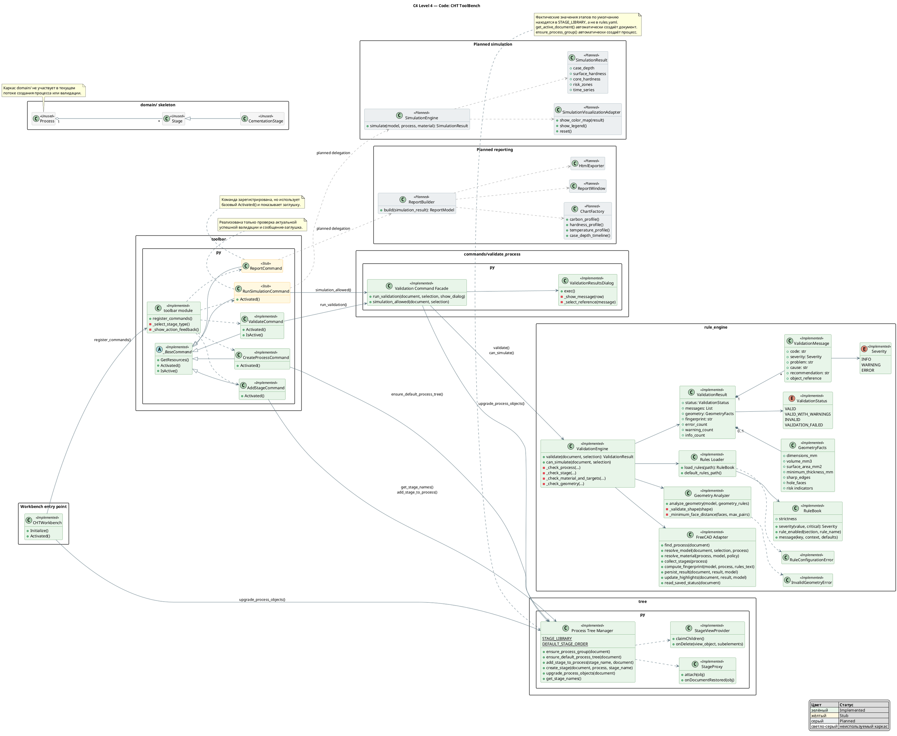

# 4. C4 Code: текущий и проектируемый код CHT ToolBench

Date: 2026-06-14

## Status

Accepted

## Context

Structurizr не поддерживает C4 Code diagram как нативный view. Эта диаграмма фиксирует структуру существующего Python-кода и отделяет её от проектируемых классов моделирования и отчётности.

## Decision

## Consequences

Диаграмма следует фактическим импортам и вызовам. Проектируемые классы моделирования и отчётности не существуют в репозитории и показаны только как возможные границы будущего кода. Текущие `domain.Process`, `domain.Stage` и `domain.CementationStage` не интегрированы с объектами FreeCAD из `tree.py`.
