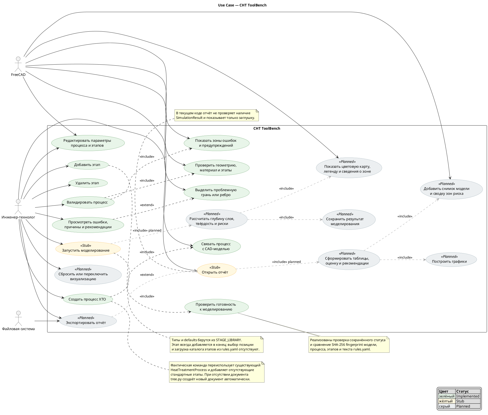

# 5. Use Case всей системы CHT ToolBench

Date: 2026-06-14

## Status

Accepted

## Context

Диаграмма показывает полный функциональный контур плагина с точки зрения инженера-технолога, включая реализованные функции, зарегистрированные заглушки и проектируемые сценарии.

## Decision

## Consequences

Use cases моделирования, цветовой карты, формирования и экспорта отчёта являются целевым поведением из `memorybank/`, а не описанием существующей реализации. Удаление этапа уже возможно штатным удалением объекта FreeCAD через `StageViewProvider`, хотя отдельной toolbar-команды для него нет.
