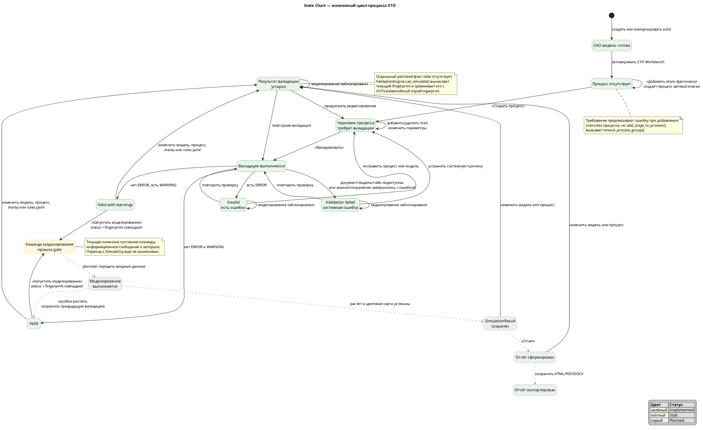

# 6. State Chart жизненного цикла процесса ХТО

Date: 2026-06-14

## Status

Accepted

## Context

Состояние системы определяется наличием процесса, актуальностью входных данных и последним результатом валидации. Состояния моделирования и отчётности добавлены как проектируемое продолжение жизненного цикла.

## Decision

## Consequences

Статусы `VALID`, `VALID_WITH_WARNINGS`, `INVALID` и `VALIDATION_FAILED` соответствуют `ValidationStatus`. Устаревание является вычисляемым состоянием: оно обнаруживается перед моделированием по несовпадению fingerprint, а не сохраняется отдельным свойством документа.
