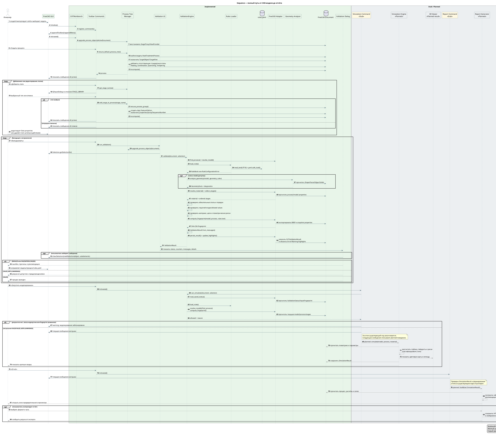

# 7. Sequence полного пользовательского пути

Date: 2026-06-14

## Status

Accepted

## Context

Диаграмма объединяет создание процесса, добавление этапов, цикл валидации, проверку актуальности результата и проектируемое продолжение через моделирование и отчёт.

## Decision

## Consequences

Цикл валидации соответствует существующему коду. Planned-вызовы начинаются только после сообщения-заглушки `RunSimulationCommand` и после сообщения-заглушки `ReportCommand`. Изменение модели, процесса, этапов или текста `rules.yaml` после успешной валидации блокирует моделирование из-за нового fingerprint.
