# 8. Activity процесса валидации rule engine

Date: 2026-06-14

## Status

Accepted

## Context

Диаграмма детализирует фактический поток `commands.validate_process.run_validation()` и `rule_engine.engine.ValidationEngine.validate()`, включая частичные отказы и сохранение результата в документе FreeCAD.

## Decision

```plantuml
@startuml
title Activity — фактический процесс валидации rule engine
skinparam shadowing false
skinparam activity {
  BackgroundColor #E8F5E9
  BorderColor #2E7D32
  DiamondBackgroundColor #FFF8E1
  DiamondBorderColor #F9A825
  ArrowColor #546E7A
}

start

partition "commands.validate_process" {
  :Получить ActiveDocument и selection;
  :tree.upgrade_process_objects(document);
  :Создать ValidationEngine\nи вызвать validate(document, selection);
}

partition "ValidationEngine.validate" {
  :find_process(document);
  :resolve_model(document, selection, process);

  if (document отсутствует?) then (да)
    :Создать HTO-SYS-001;
    :ValidationResult.from_messages(\nsystem_failure=True);
    :Вернуть VALIDATION_FAILED;
    partition "commands.validate_process" {
      :Записать итог в FreeCAD Console;
      :Показать ValidationResultsDialog,\nесли show_dialog=True;
    }
    stop
  else (нет)
  endif

  :Инициализировать messages, facts,\nmaterial, fingerprint, system_failure;
}

partition "Rules Loader" {
  :Прочитать rules.yaml как UTF-8;
  :yaml.safe_load();
  :Проверить обязательные разделы,\nstrictness, source_priority и required_stages;
}

partition "ValidationEngine.validate" {
  if (rules.yaml загружен?) then (да)
    :Сохранить RuleBook;
  else (нет)
    :Добавить HTO-SYS-002;
    :system_failure = True;
    note right
      Валидация не завершается немедленно.
      Rule-based ветви ниже будут пропущены,
      после чего результат всё равно сохраняется.
    end note
  endif

  if (model найден?) then (да)
    if (process существует?) then (да)
      :Обновить process.TargetObject\nи process.TargetPart;
    else (нет)
    endif
  else (нет)
    :Добавить HTO-MODEL-001;
    :system_failure = True;
  endif

  if (RuleBook и model доступны?) then (да)
    partition "Geometry Analyzer" {
      :Получить model.Shape;
      :Проверить isNull(), isValid(), isClosed(),\nровно один Solid, Faces/Edges, Volume/Area;

      if (solid-геометрия корректна?) then (да)
        :Извлечь dimensions, volume, area,\nsurface/volume, counts;
        :Найти цилиндрические поверхности,\nотверстия, малые отверстия и канавки;
        :Найти острые рёбра и минимальный радиус;
        :Оценить минимальное расстояние между\nпарами граней с лимитом max_face_pairs;
        :Вычислить slenderness, face-area ratio,\ncavities, massive zones и transitions;
        :Сформировать GeometryFacts;
        if (анализ толщины неполон?) then (да)
          :Добавить HTO-GEO-090 или HTO-GEO-091;
        else (нет)
        endif
      else (нет)
        :Бросить InvalidGeometryError;
      endif
    }

    partition "ValidationEngine.validate" {
      if (InvalidGeometryError?) then (да)
        :Добавить HTO-MODEL-002;
        :system_failure = True;
      else (нет)
        if (другая ошибка анализа?) then (да)
          :Добавить HTO-SYS-003;
          :system_failure = True;
        else (нет)
          :Добавить geometry diagnostics\nс severity из RuleBook;
        endif
      endif
    }
  else (нет)
  endif

  if (RuleBook доступен?) then (да)
    partition "FreeCAD Adapter" {
      :resolve_material(process, model,\nmaterial_policy.source_priority);
    }

    partition "ValidationEngine.validate" {
      :Нормализовать material_aliases;
      if (материал отсутствует?) then (да)
        :Добавить HTO-MAT-001;
      else (нет)
        if (использован default?) then (да)
          :Добавить HTO-MAT-002;
        else (нет)
        endif
      endif

      if (process отсутствует?) then (да)
        :Добавить HTO-PROC-000;
      else (нет)
        partition "Process and stage checks" {
          :collect_stages(process)\nи оставить Enabled=True;
          if (нет активных этапов?) then (да)
            :Добавить HTO-PROC-000\nи завершить process checks;
          else (нет)
            :Найти process_rules[ProcessKey];
            if (тип процесса неизвестен?) then (да)
              :Добавить HTO-PROC-099\nи завершить process checks;
            else (нет)
              :Канонизировать StageType\nчерез stage_aliases;
              :Проверить положительные и уникальные\nSequenceNumber → HTO-PROC-002;
              :Проверить required_stages\n→ HTO-PROC-001;
              :Проверить allowed_order и неизвестные этапы\n→ HTO-PROC-003/006;

              while (есть следующий Enabled stage?) is (да)
                :Найти stage_rules[canonical type];
                if (правило этапа enabled?) then (да)
                  :Проверить required_properties\n→ HTO-PARAM-001;
                  :Проверить numeric ranges\n→ HTO-PARAM-002;
                  :Проверить allowed_values\n→ HTO-PARAM-003;
                else (нет)
                endif
              endwhile (нет)

              :Проверить наличие material config\n→ HTO-MAT-003;
              :Проверить compatible_processes\n→ HTO-MAT-004;
              :Проверить target case depth,\nsurface/core hardness → HTO-TARGET-001;
              :Проверить quench medium\n→ HTO-MAT-005;
              :Сопоставить target depth с\ncoefficient * sqrt(DurationHours)\n→ HTO-TARGET-002;
            endif
          endif
        }
      endif

      if (GeometryFacts доступны?) then (да)
        partition "Geometry risk checks" {
          :Тонкие стенки → HTO-GEO-001;
          :Острые кромки → HTO-GEO-002;
          :Малые отверстия → HTO-GEO-003;
          :Полости → HTO-GEO-004;
          :Резкие переходы → HTO-GEO-005;
          :Высокое/низкое surface-to-volume\n→ HTO-GEO-006/007;
          :Длинные тонкие элементы → HTO-GEO-008;
          :Пазы и канавки → HTO-GEO-009;
        }
      else (нет)
      endif

      if (model доступна?) then (да)
        partition "FreeCAD Adapter" {
          :Экспортировать model.Shape в BREP;
          :Сериализовать properties процесса и этапов;
          :Добавить полный текст rules.yaml;
          :Вычислить SHA-256 fingerprint;
        }
        if (fingerprint вычислен?) then (да)
        else (нет)
          :Добавить HTO-SYS-004;
          :system_failure = True;
        endif
      else (нет)
      endif
    }
  else (нет)
  endif

  partition "Result aggregation" {
    :ValidationResult.from_messages();
    note right
      system_failure → VALIDATION_FAILED
      иначе есть ERROR → INVALID
      иначе есть WARNING → VALID_WITH_WARNINGS
      иначе → VALID
    end note
  }
}

partition "Persistence and highlighting" {
  :Найти/создать CHTValidationResult;
  :Сохранить status, counters, MessagesJson,\nmaterial, fingerprint и Model link;
  :Найти/создать highlight group\nи Error/Warning Part::Feature;
  :Собрать compound из указанных Face/Edge;
  :Назначить красный/жёлтый цвет и visibility;
  :document.recompute();

  if (сохранение и подсветка успешны?) then (да)
  else (нет)
    :Добавить HTO-SYS-005;
    :result.system_failure = True;
    :result.status = VALIDATION_FAILED;
  endif
}

partition "commands.validate_process" {
  :Записать status и counters\nв FreeCAD Console;
  if (show_dialog=True?) then (да)
    :Создать ValidationResultsDialog;
    :Показать status, counters, context,\nтаблицу сообщений и details;
    if (пользователь выбирает строку?) then (да)
      :Выделить object_name и subelements\nчерез FreeCADGui.Selection;
    else (нет)
    endif
  else (нет)
  endif
  :Вернуть ValidationResult;
  note right
    ValidationEngine._add() применяет RuleBook.message()
    и RuleBook.severity(): soft понижает ERROR до WARNING,
    strict повышает WARNING до ERROR, critical не изменяется.
  end note
}

stop
@enduml
```

## Consequences

Диаграмма описывает текущую реализацию и не включает физическое моделирование. Даже при ошибке загрузки `rules.yaml` движок формирует и пытается сохранить `ValidationResult`. Ошибка сохранения или подсветки добавляется уже после первоначального вычисления статуса и принудительно переводит результат в `VALIDATION_FAILED`.
